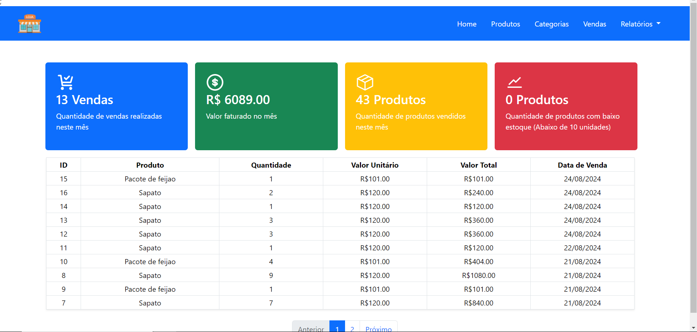
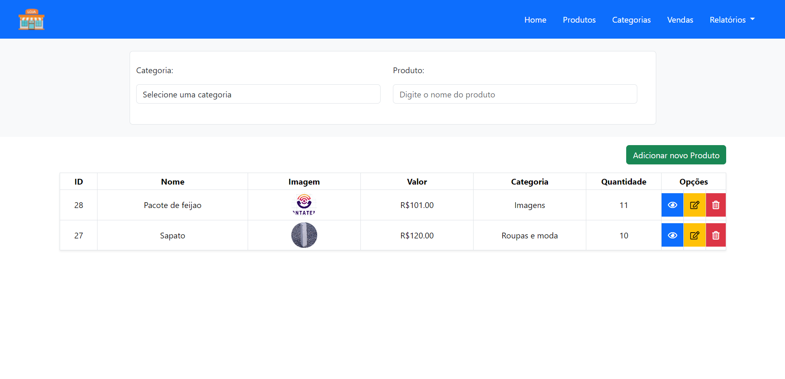
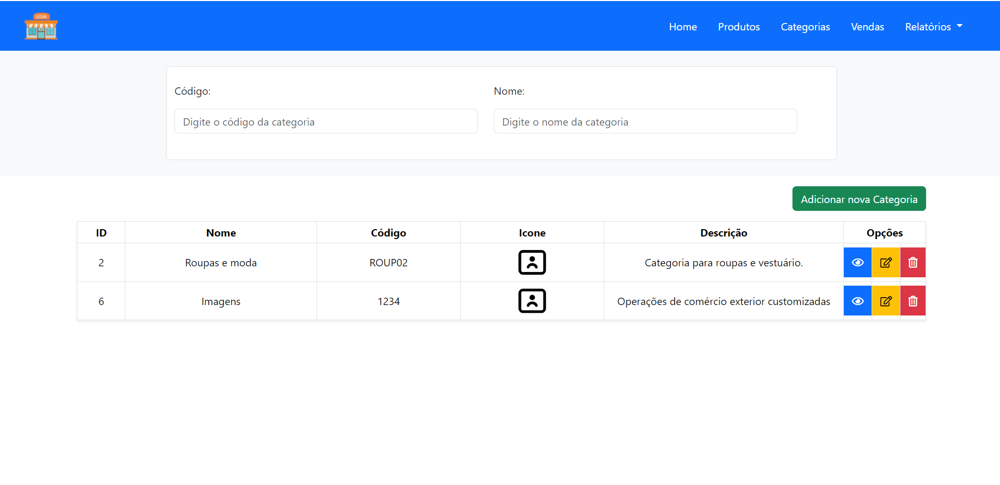
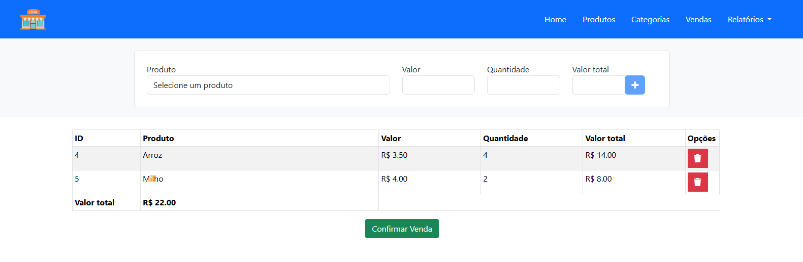
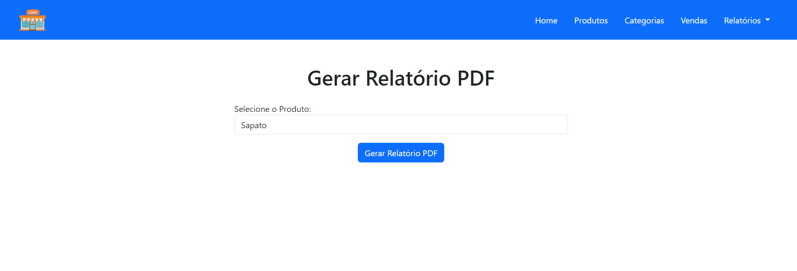

# Stock

Bem-vindo ao projeto Stock! Este é um sistema desenvolvido para gerenciar compras e estoque de produto.

## Requisitos

Antes de começar, certifique-se de ter os seguintes softwares instalados em sua máquina:

- **PHP >= 8.2**
- **Laravel 11**
- **Composer**
- **Node.js (com NPM)**
- **MySQL**

## Instalação

Siga os passos abaixo para configurar o projeto localmente.

## Tecnologias Usadas

- **Bootstrap**
- **Livewire**
- **Laravel DomPDF**

### 1. Clone o Repositório

Primeiro, clone o repositório do projeto para o seu ambiente local:

```bash
git clone [https://github.com/Wesley085/stock.git]
cd stock
```
### 2. Configuração do Ambiente

```bash
cp .env.example .env
```

### 3. Instale as Dependências do PHP

```bash
composer install
```

### 4. Instale as Dependências do Node.js

```bash
npm install vite --save-dev
```
### 5. Build dos Arquivos Frontend

```bash
npm run build
```
### 6. Configuração do Banco de Dados
Configure o banco de dados no arquivo .env, ajustando as variáveis DB_DATABASE, DB_USERNAME e DB_PASSWORD conforme necessário.

### 7. Executar Migrações

```bash
php artisan migrate
```
### 8. Popular o Banco de Dados

```bash
php artisan migrate
```
### 9. Inicie o Servidor de Desenvolvimento

```bash
php artisan serve
```

A aplicação estará disponível em http://localhost:8000.








